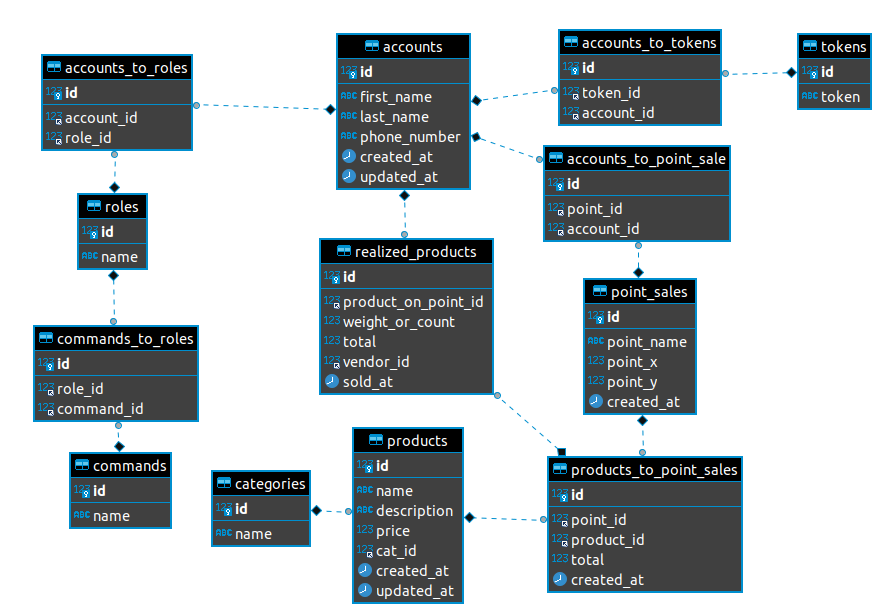

###Описание курсового проекта:
База данных(БД) веб сервера и сервера приложений, сетевых точек продаж овощей и фруктов "Фруктовая азбука".
В данной БД осуществляется ведение и учёт сотрудников, разграничение прав доступа на основе ролей пользователей,
учёт товара на точках продаж. Продажа товара осуществляется по средством хранимой процедуры.

|||
 
